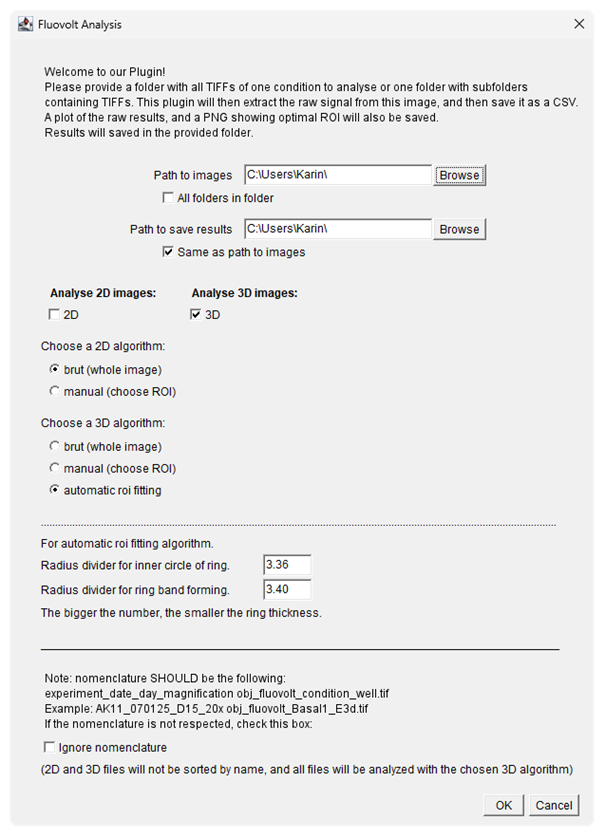

 # 1. Image analysis 

This first part of the analysis is done using the **ImageJ plugin**. This plugin takes as input TIFF images (or subfolders of TIFF images) and outputs a CSV file with raw results: the mean fluorescence intensity of the image over time. A plot of the raw data over time, and an image of the sum of slices with the fitted ROI overlaid (if applicable) are also saved.

## User guide 

### a. Installation

The plugin is available for download [here](https://github.com/matou1604/fluovoltanalysis/blob/main/project-template-main/project-template-main/target/fluovoltanalyis-1.0.0-beta.jar).

No complementary packages are required to run the plugin, as all dependencies are included in the `.jar` file.

Once downloaded, you can drag the `.jar` file into a specific folder of the ImageJ folder. You can rename the file if you want to. First find the ImageJ file location by right-clicking on the app and selecting *open file location*. Then drag the `.jar` file into the **plugins** folder. The complete path should be something like this: `C:\Fiji.app\plugins`. 

Restart ImageJ if it was open and the plugin will be available in the *Plugins* menu, under *4Dcell*:
<div style="text-align: left;">
    
</div>

<br>

### b. Running the plugin

When running the plugin, a user interface window will appear. 

<div style="padding: 1px;">
    
</div>


- Select the folder containing the images you want to analyze. If you only want to analyze the TIFFs in the folder, select that folder. If you want to analyze all images in all subfolders of your selected folder, check the box *All folders in folder*.

- Select the path to the folder where you want to save the results. The plugin will create a folder with the same name as the input folder and save the results there. If you want to save the results in the same folder as the images, check the box *Same as path to images*.

- Choose whether you want to analyze 2D images (cell monolayer) or 3D images (SmartHeart, or other ring-shaped images), and check the corresponding box.

- Choose an algorithm for each image type. The list of available algorithms and how they work is available in the [algorithms](#algorithms) section.
    
When choosing one of the *automatic ROI fitting* algorithms, you can adjust the inner and outer radii of the ring. To do so, change the value of the inner and outer radii dividers, which are inversely proportional to the radii. For example, if you want to increase the outer radius, decrease the outer radius divider to 3.


```{note}
The nomenclature should be as follows: experiment_date_day_magnification obj_fluovolt_condition_well.tif. 

Example: AK11_070125_D15_20x obj_fluovolt_Basal1_E3d.tif

If your files have different names, check the "Ignore nomenclature" box. The plugin will then analyze all TIFF files in the selected folder, and save the outputs in a folder named Results.
```

During the analysis, the plugin will display the analysis of the images. You can follow the progress of the analysis in the ImageJ log window.

<br>

### c. Results 

For each image analyzed, the plugin will output a CSV file containing the mean intensity values for each frame, a plot of the raw data over time, and an image of the sum of slices with the fitted ROI overlaid (if applicable).


<div style="display: flex; justify-content: space-between;">
    <table style="width: 45%;">   
        <thead>
            <tr style="border-bottom: 1px solid #000000;">
                <th>Frame</th>
                <th>Mean Intensity</th>
            </tr>
        </thead>
        <tbody>
            <tr style="border-bottom: 1px solid #000000;">
                <td>1</td>
                <td>179.17</td>
            </tr>
            <tr style="border-bottom: 1px solid #000000;">
                <td>2</td>
                <td>179.51</td>
            </tr>
            <tr style="border-bottom: 1px solid #000000;">
                <td>3</td>
                <td>179.19</td>
            </tr>
            <tr style="border-bottom: 1px solid #000000;">
                <td>4</td>
                <td>179.14</td>
            </tr>
            <tr style="border-bottom: 1px solid #000000;">
                <td>5</td>
                <td>179.03</td>
            </tr>
        </tbody>
    </table>
    <div style="width: 5%;"></div>
    <div style="width: 100%; display: flex; justify-content: space-between;">
         
        
    </div>
</div>


<br>

## Java code

The Java script processes fluorescence images in TIFF format to extract raw signal intensities and generate outputs as CSVs and images. This tool allows for the analysis of both 2D (monolayer) and 3D (SmartHeart) images using different algorithms.

The *FluovoltAnalysis* file and class contains the bulk of the code. The analysis begins with a user interface, where the user specifies the folder containing the TIFF images and output folder. They can choose between analyzing 2D or 3D images and select a specific algorithm to apply. Once the selections are made, the script processes the images by listing and filtering files according to the expected nomenclature. 2D and 3D images are separated here, and non TIFF images are ignored. 

### <a name="algorithms"></a>Algorithms
 
The algorithm selected by the user is then applied to extract signal intensities. The plugin provides multiple algorithms for image analysis. 
- `Brut analysis:` processes the entire image without selecting a specific region and measures the mean signal intensity for each frame. 
- `Manual ROI Selection:` allows the user to define a Region of Interest (ROI) manually and extracts signal intensities from that specific area. 
- `Automatic ROI Fitting:` scans the image to identify the optimal circular region for analysis, and processes the results using the *CSVanalysis* class. It then refines the selection through an iterative process, and finally measures the signal intensity within the optimized ROI. For a ring of different size, the inner and outer ring radius can be adjusted in the initial user interface. This method only works for ring-shaped images. To verify the ROI, the plugin saves an image of the sum of slices with the fitted ROI overlaid.
- `Mask-Based analysis (work in progress):` converts the image to a binary mask using thresholding and measures the signal intensity within the masked region. 
- `Combined ROI and Masking (work in progress):` merges automatic ROI fitting with threshold-based masking, ensuring that the ROI is positioned in the most relevant region while only measuring the above-threshold pixels in that optimized ROI.


The results of the analysis are saved as CSV files, containing the mean intensity values. These results are also plotted and saved as a PNG file, with a prefix added to its file name.

